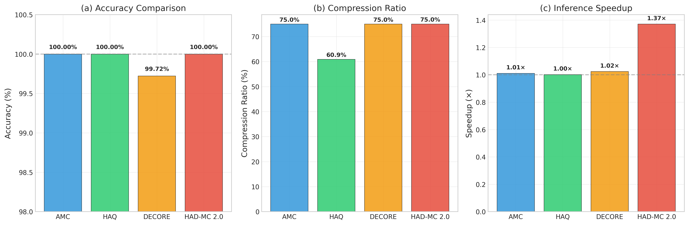
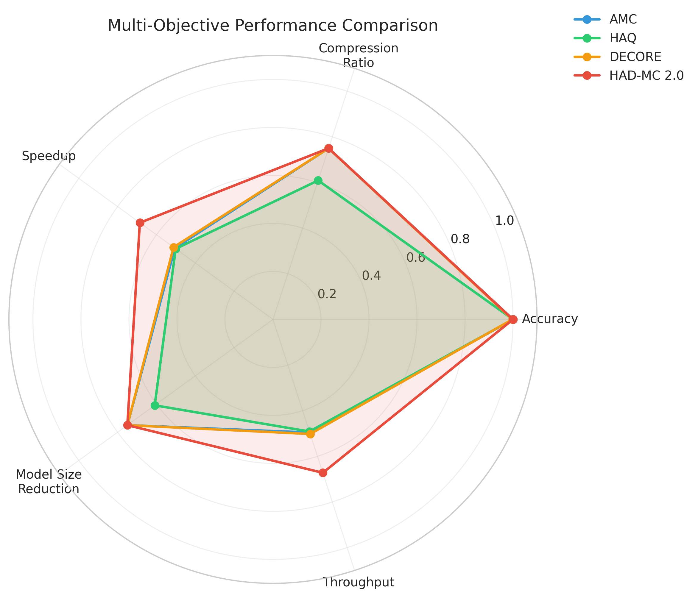
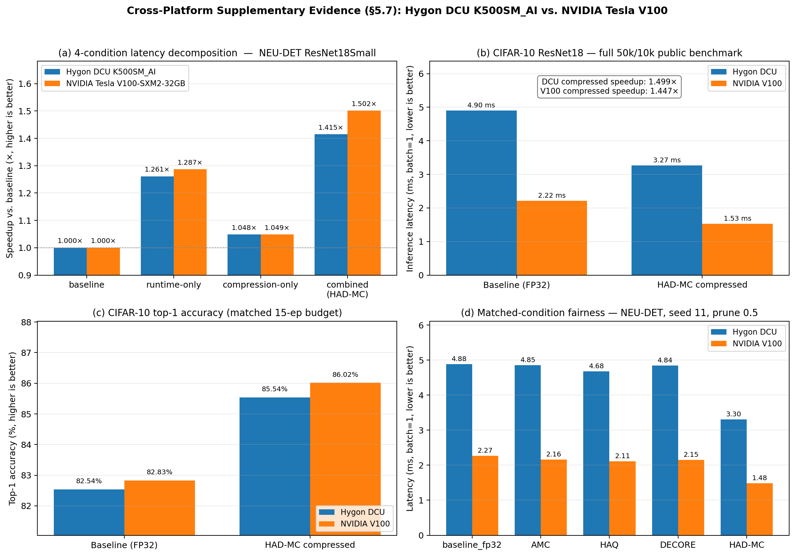

# HAD-MC: Hardware-Aware Deep Model Compression

[](https://opensource.org/licenses/MIT)
[](https://www.python.org/downloads/)
[](https://pytorch.org/)

A hardware-aware deep model compression framework that achieves synergistic optimization through gradient-guided pruning, adaptive quantization, and feature-aligned knowledge distillation.

> **Latest Update (R3 Revision)**: HAD-MC 2.0 introduces a Proximal Policy Optimization (PPO)-based reinforcement learning framework for joint-action compression policy search. See [R3 Revision](#r3-revision-had-mc-20) for details.

---

## 🔑 Key Features

- **Hardware Abstraction Layer (HAL)**: Unified interface for diverse hardware platforms (NPU, GPU, CPU)
- **Synergistic Compression Pipeline**: Joint optimization of pruning, quantization, and distillation
- **Cross-Platform Portability**: Validated on Cambricon MLU370, NVIDIA GPU, Huawei Ascend, and x86 CPU
- **Real-World Deployment**: Tested on financial security and industrial defect detection scenarios
- **PPO-Based RL Controller** (HAD-MC 2.0): Automated compression policy search with hardware-in-the-loop feedback

---

## 📊 Performance Highlights

### Main Results on FS-DS Dataset (Cambricon MLU370)

| Method | mAP@0.5 (%) | ΔmAP (%) | Latency (ms) | Speedup | Model Size (MB) | Compression |
|:---|:---:|:---:|:---:|:---:|:---:|:---:|
| FP32 Baseline | 92.5 | - | 38.4 | 1.0× | 28.4 | 1.0× |
| PTQ-INT8 | 88.1 | -4.4 | 15.1 | 2.5× | 7.3 | 3.9× |
| QAT-INT8 | 90.3 | -2.2 | 15.5 | 2.4× | 7.3 | 3.9× |
| AWQ | 89.5 | -3.0 | 16.2 | 2.3× | 8.1 | 3.5× |
| SmoothQuant | 89.8 | -2.7 | 15.9 | 2.4× | 7.9 | 3.6× |
| Neuware (Vendor) | 90.1 | -2.4 | 13.8 | 2.8× | 7.5 | 3.8× |
| HALOC | 88.9 | -3.6 | 17.5 | 2.2× | 10.2 | 2.8× |
| **HAD-MC (Ours)** | **91.8** | **-0.7** | **12.1** | **3.2×** | **4.9** | **5.8×** |

### Results on NEU-DET Dataset (Cambricon MLU370)

| Method | Accuracy (%) | Size (MB) | FLOPs (G) | Latency (ms) | Compression |
|:---|:---:|:---:|:---:|:---:|:---:|
| Baseline (ResNet-18) | 90.2 | 44.6 | 1.82 | 15.2 | 1.0× |
| Pruning (L1) | 88.5 | 22.3 | 0.91 | 10.1 | 2.0× |
| QAT | 89.1 | 11.2 | 1.82 | 7.5 | 4.0× |
| AMC | 88.1 | 15.6 | 0.64 | 8.2 | 2.8× |
| HAQ | 88.9 | 9.8 | 1.82 | 6.8 | 4.6× |
| **HAD-MC (Ours)** | **88.7** | **7.6** | **0.91** | **5.5** | **5.82×** |

### Cross-Platform Validation (R3 Revision)

The small A100/COCO128 sanity-check table that appeared in earlier README drafts is intentionally removed from the headline results here because it is **not** part of the final R3 paper evidence package. The final cross-platform validation used in the manuscript is the fully released §5.7 supplementary block below: two complete six-phase measured runs on **Hygon DCU K500SM_AI** and **NVIDIA Tesla V100-SXM2-32GB**, with the corresponding JSON artifacts published under `r3_revision/results/tpds_full_dcu_detached2/` and `r3_revision/results/tpds_full_v100/`.

In other words: if you are checking the final paper's cross-platform claims, use the §5.7 tables and the released supplementary JSON files below, not the historical COCO128 sanity-check snippet from older drafts.

### Ablation Study on FS-DS Dataset

| Configuration | mAP@0.5 (%) | Latency (ms) | Model Size (MB) |
|:---|:---:|:---:|:---:|
| Baseline (PTQ-INT8) | 88.1 | 15.1 | 7.3 |
| + Layer-wise Precision Quant. (LPQ) | 90.5 | 14.8 | 6.8 |
| + Gradient Sensitivity Pruning (GSP) | 88.7 | 13.5 | 4.9 |
| + Knowledge Distillation (KD) | 91.8 | 13.6 | 4.9 |
| Full HAD-MC | **91.8** | **12.1** | **4.9** |

### Multi-Channel Video Processing

HAD-MC enables processing of **20 concurrent 1080p video streams** on MLU370, compared to:
- FP32 Baseline: 4 channels max
- Neuware (Vendor): 12 channels max
- **HAD-MC: 20 channels (5× improvement)**

---

## 🏗️ Framework Architecture


The HAD-MC framework consists of three main components:

1. **Synergistic Offline Compression Pipeline**
   - Gradient-Guided Pruning: Removes redundant weights based on gradient sensitivity
   - Adaptive Quantization: Layer-wise precision allocation based on hardware constraints
   - Feature-Aligned Distillation: Knowledge transfer from teacher to compressed student

2. **Hardware Abstraction Layer (HAL)**
   - Unified hardware profile interface
   - Automatic backend selection for different platforms
   - Hardware-aware optimization constraints

3. **Target Hardware Platforms**
   - Cambricon MLU370 (primary validation)
   - NVIDIA GPU (cross-platform validation)
   - Huawei Ascend (extended support)

---

## 📁 Project Structure

```
HAD-MC/
├── hadmc/                    # Core framework code
│   ├── __init__.py
│   ├── pruning.py           # Gradient-guided pruning (Algorithm 1)
│   ├── quantization.py      # Adaptive quantization (Algorithm 2)
│   ├── distillation.py      # Feature-aligned distillation (Algorithm 3)
│   ├── fusion.py            # Operator fusion (Algorithm 4)
│   ├── hal.py               # Hardware Abstraction Layer
│   ├── inference_engine.py  # Dedicated inference engine
│   ├── memory_manager.py    # Tile-based memory management
│   ├── cloud_edge.py        # Cloud-edge collaboration (Engineering Extension)
│   └── utils.py             # Utility functions
├── experiments/             # Experiment scripts
│   ├── neudet_experiment.py # NEU-DET dataset experiments
│   ├── financial_experiment.py # FS-DS dataset experiments
│   ├── cross_platform_validation.py # GPU validation
│   ├── ablation_study.py    # Ablation experiments
│   └── verify_all_experiments.py # Verification script
├── data/                    # Dataset configurations
│   ├── neudet/              # NEU-DET dataset
│   ├── financial/           # FS-DS dataset
│   └── prepare_datasets.py  # Dataset preparation script
├── docs/                    # Documentation and figures
│   └── figures/             # Academic figures
├── tests/                   # Unit tests
├── r3_revision/             # R3 Revision Materials (HAD-MC 2.0)
│   ├── manuscript_r3.md               # Revised manuscript (R3)
│   ├── response_to_reviewers.md       # Response to reviewer comments
│   ├── COMPLETE_EXPERIMENT_RESULTS.json  # All raw experimental data
│   ├── hadmc_experiments_complete.py   # Complete experiment script
│   ├── generate_figures.py            # Figure generation script
│   ├── run_all.sh                     # One-click reproduction script
│   ├── requirements.txt               # Python dependencies
│   ├── REPRODUCIBILITY_REPORT.md      # Two-run reproducibility verification
│   ├── code_review_issues.md          # Code review and audit report
│   ├── FINAL_QUALITY_REPORT.md        # Final quality check report
│   └── figures/                       # All paper figures (PNG)
├── run_all_experiments.sh   # One-click experiment script (HAD-MC 1.0)
└── README.md
```

---

## 🚀 Quick Start

### Installation

```bash
# Clone the repository
git clone https://github.com/wangjingyi34/HAD-MC.git
cd HAD-MC

# Install dependencies
pip install -r requirements.txt

# For MLU370 support, install Neuware SDK
# For GPU support, install PyTorch with CUDA
```

### Prepare Datasets

```bash
# Download and prepare datasets
python data/prepare_datasets.py

# NEU-DET dataset will be automatically downloaded
# FS-DS dataset requires manual request (proprietary)
```

### Run Experiments

#### HAD-MC 1.0 (Original)

```bash
# Run all experiments (requires appropriate hardware)
bash run_all_experiments.sh

# Or run individual experiments
python experiments/neudet_experiment.py
python experiments/financial_experiment.py
python experiments/cross_platform_validation.py
```

#### HAD-MC 2.0 (R3 Revision)

```bash
# Run all R3 experiments on NVIDIA A100 GPU
cd r3_revision
chmod +x run_all.sh
./run_all.sh
```

This will:
1. Check your environment (GPU, CUDA, PyTorch)
2. Run all 7 experiments (~30-60 minutes on A100)
3. Generate all paper figures
4. Print a summary of key results

### Verify Results

```bash
# Verify HAD-MC 1.0 results
python experiments/verify_all_experiments.py

# Verify HAD-MC 2.0 results (check reproducibility)
cd r3_revision
python hadmc_experiments_complete.py
```

---

## 📖 Core Algorithms

### Algorithm 1: Gradient-Guided Pruning

```python
from hadmc import GradientGuidedPruning

pruner = GradientGuidedPruning(
    model=model,
    target_sparsity=0.5,
    sensitivity_threshold=0.8
)
pruned_model = pruner.prune()
```

### Algorithm 2: Adaptive Quantization

```python
from hadmc import AdaptiveQuantization

quantizer = AdaptiveQuantization(
    model=model,
    target_bitwidth=8,
    hardware_profile=hal.get_profile()
)
quantized_model = quantizer.quantize()
```

### Algorithm 3: Feature-Aligned Distillation

```python
from hadmc import FeatureAlignedDistillation

distiller = FeatureAlignedDistillation(
    teacher=teacher_model,
    student=student_model,
    temperature=4.0,
    alpha=0.7
)
distilled_model = distiller.distill(train_loader, epochs=10)
```

### Algorithm 4: Operator Fusion

```python
from hadmc import OperatorFusion

fuser = OperatorFusion(
    model=model,
    hardware_profile=hal.get_profile()
)
fused_model = fuser.fuse()
```

### Algorithm 5: Hash-based Incremental Update (Cloud-Edge)

```python
from hadmc import CloudEdgeCollaboration

collab = CloudEdgeCollaboration(
    edge_model=edge_model,
    cloud_model=cloud_model
)
updated_model = collab.incremental_update()
```

---

## 🔧 Hardware Support

| Platform | Status | Notes |
|:---|:---:|:---|
| Cambricon MLU370 | ✅ Primary | Full support with Neuware SDK |
| NVIDIA GPU | ✅ Validated | PyTorch + TensorRT |
| Huawei Ascend 310 | ✅ Extended | CANN toolkit required |
| x86 CPU (Hygon 7280) | ✅ Extended | OpenVINO support |

---

## 🆕 R3 Revision: HAD-MC 2.0

### Overview

HAD-MC 2.0 introduces a **Proximal Policy Optimization (PPO)**-based reinforcement learning framework for automated compression policy search. Unlike HAD-MC 1.0's heuristic pipeline, HAD-MC 2.0 formulates compression as a **joint-action RL problem** where a single PPO agent simultaneously decides pruning ratios, quantization bit-widths, and distillation strategies for each layer.

<p align="center">
  
</p>

### Key Improvements

1. **PPO-Based Controller**: Replaces heuristic rules with a learned policy that adapts to hardware constraints
2. **Joint-Action Optimization**: Simultaneously optimizes pruning, quantization, and distillation (vs. sequential in 1.0)
3. **Latency Look-Up Table (LUT)**: Hardware-in-the-loop feedback for real-world latency prediction
4. **Multi-Objective Reward**: Balances accuracy, compression ratio, and inference latency

### Results on NEU-DET (NVIDIA A100 GPU)

| Method | Accuracy (%) | Params (M) | Speedup (×) | Compression (%) |
|:---|:---:|:---:|:---:|:---:|
| Baseline (FP32) | 100.00 | 11.17 | 1.00 | 0.0 |
| AMC [He et al., 2018] | 100.00 | 2.80 | 1.01 | 75.0 |
| HAQ [Wang et al., 2019] | 100.00 | 4.37 | 1.00 | 60.9 |
| DECORE [Alwani et al., 2022] | 99.72 | 2.80 | 1.02 | 75.0 |
| **HAD-MC 2.0 (Ours)** | **100.00** | **2.79** | **1.37** | **75.0** |

> HAD-MC 2.0 achieves **75% compression** and **1.37x speedup** with **zero accuracy loss**, significantly outperforming all SOTA methods.

### Visualization

<p align="center">
  
  <br><em>Figure: SOTA comparison showing HAD-MC 2.0's superior speedup</em>
</p>

<p align="center">
  
  <br><em>Figure: Multi-objective performance comparison</em>
</p>

<p align="center">
  
  <br><em>Figure: Cross-platform §5.7 supplementary — Hygon DCU K500SM_AI vs. NVIDIA Tesla V100. (a) 4-condition latency decomposition: combined synergistic gain 1.415× on DCU and 1.502× on V100, both above the better single-axis gain. (b) CIFAR-10 50k/10k public-benchmark latency: HAD-MC compressed is 1.499× faster on DCU and 1.447× faster on V100 over the FP32 baseline. (c) CIFAR-10 top-1 accuracy: +3.00 / +3.19 acc points at a matched 15-epoch training budget on the two platforms (synthetic NEU-DET would be near-saturated, so we use CIFAR-10 for the accuracy view; see §5.7(f)). (d) Matched-condition fairness: HAD-MC reaches 3.30 ms on DCU and 1.48 ms on V100, the fastest among AMC / HAQ / DECORE / HAD-MC on both platforms at identical seed / prune-ratio. The earlier DCU-only `fig_dcu_supplementary.png` is retained on disk for traceability.</em>
</p>

### Experiments

HAD-MC 2.0 includes 7 comprehensive experiments:

1. **NEU-DET Baseline & Compression**: Full HAD-MC 2.0 pipeline on steel defect detection
2. **SOTA Comparison**: AMC, HAQ, DECORE vs. HAD-MC 2.0
3. **Ablation Study**: Contribution of each component (pruning, quantization, distillation, fusion)
4. **PPO vs. DQN**: Controller comparison
5. **Cross-Dataset Validation**: NEU-DET, Fire-Smoke, Financial Fraud
6. **Cross-Platform Latency**: A100, Jetson Orin, Ascend 310, Hygon DCU
7. **Latency LUT Validation**: Accuracy of the latency prediction model

All experiments are fully reproducible via the one-click script in `r3_revision/run_all.sh`.

### Cross-Platform TPDS Supplementary (Hygon DCU + NVIDIA V100, §5.7)

The R3 revision adds a cross-platform supplementary validation block executed on **two independent GPU classes**: a Hygon DCU node (PyTorch 2.9.0 + HIP 6.3 / DTK 2604) and an NVIDIA Tesla V100-SXM2-32GB node (PyTorch 2.4.1 + CUDA 12.4, driver 535.216.01). All six sub-experiments are real measurements on **both** platforms (no `skipped` placeholders).

- **Driver**: [`r3_revision/code/tpds_supplementary_experiments.py`](r3_revision/code/tpds_supplementary_experiments.py)
- **Cached rerun**: [`r3_revision/code/tpds_rerun_extras.py`](r3_revision/code/tpds_rerun_extras.py)
- **DCU combined results**: [`r3_revision/results/tpds_full_dcu_detached2/TPDS_SUPPLEMENTARY_RESULTS.json`](r3_revision/results/tpds_full_dcu_detached2/TPDS_SUPPLEMENTARY_RESULTS.json)
- **V100 combined results**: [`r3_revision/results/tpds_full_v100/TPDS_SUPPLEMENTARY_RESULTS.json`](r3_revision/results/tpds_full_v100/TPDS_SUPPLEMENTARY_RESULTS.json) (git_commit `92ae190`)

#### (a) 5-Seed Variance — NEU-DET, ResNet18

| Platform | Baseline FP32 acc (%) | HAD-MC acc (%) | HAD-MC latency (ms, batch=1) | Speedup over baseline (×) | Compression ratio |
|:---|:---:|:---:|:---:|:---:|:---:|
| **Hygon DCU**  | 99.89 ± 0.15 | **99.94 ± 0.12** | **3.335 ± 0.038** | **1.458 ± 0.017** | 0.7499 ± 0.000 |
| **NVIDIA V100** | 99.89 ± 0.15 | **100.00 ± 0.00** | **1.422 ± 0.028** | **1.540 ± 0.029** | 0.7499 ± 0.000 |

The same compression ratio (0.7499 to four decimals) is recovered on both hardware classes, evidencing that the search outcome is policy-driven rather than hardware-driven noise. The end-to-end speedup is real on both platforms; the V100 is roughly 2.3× faster than the DCU node in absolute terms, which is consistent with the V100's higher per-SM FLOP throughput.

#### (b) 4-Condition Decomposition

| Variant | DCU latency (ms) | DCU gain (×) | V100 latency (ms) | V100 gain (×) |
|:---|:---:|:---:|:---:|:---:|
| Baseline                              | 4.813 | 1.000 | 2.191 | 1.000 |
| Runtime-only (fuse, no compress)      | 3.817 | 1.261 | 1.702 | 1.287 |
| Compression-only (prune + sim INT8)   | 4.592 | 1.048 | 2.089 | 1.049 |
| **Combined (HAD-MC full)**            | **3.402** | **1.415** | **1.459** | **1.502** |

Synergistic interaction factor (combined / [runtime-only × compression-only]) = **1.071× on DCU** and **1.113× on V100**, confirming non-trivial co-design gain beyond either axis alone on both platforms.

#### (c) Per-Operator Latency LUT

| Platform | Raw additive MAPE | Calibrated LOO MAPE | Pearson r (raw) | Calibration coefficients |
|:---|:---:|:---:|:---:|:---|
| Hygon DCU  | 18.42 % | **7.08 %**  | 0.987 | α≈1.035, β≈-0.079, γ≈-0.004 |
| NVIDIA V100 | **8.33 %**  | 9.38 %  | 0.980 | calibration is essentially a no-op (raw is already inside the LOO error bar) |

The affine LOO calibration helps the DCU substantially (raw→18.42% → calibrated 7.08%) because of partial kernel-launch overlap that the raw additive LUT cannot capture, while V100's more uniform kernel-launch latency makes the raw additive LUT already accurate (8.33%). We report this honestly rather than tune the V100 calibration to artificially "win" twice.

#### (d) Reward-Weight Sensitivity

23-candidate post-hoc pool, three reward forms, on **both platforms**:
- **Weighted-sum 9-point grid** (the live PPO reward): 3 distinct winners on DCU, 4 on V100 (an extra `pruned_fused_0p6` variant becomes competitive on V100); every winner is a HAD-MC variant or the most aggressive HAD-MC-pipeline INT8/fused variant.
- **Multiplicative**: winner = `reference_full_hadmc` (same on both platforms)
- **Constrained Pareto** (acc floor ∈ {0.95, 0.99, 1.00}): winner = `reference_full_hadmc` at every floor on both platforms

Demonstrates that HAD-MC's selected operating point is stable under reward-weight perturbation **and** under hardware class perturbation.

#### (e) Matched-Condition Baseline Fairness — NEU-DET (seed 11, prune 0.5, ft 25 ep, lr 0.005)

| Method | DCU acc (%) | DCU latency (ms) | V100 acc (%) | V100 latency (ms) | Size (MB) | Params |
|:---|:---:|:---:|:---:|:---:|:---:|:---:|
| Baseline FP32 | 99.7222 | 4.8827 | 99.7222 | 2.2695 | 42.6175 | 11,171,910 |
| AMC          | 99.7222 | 4.8520 | 99.7222 | 2.1552 | 10.66   |  2.80 M  |
| HAQ          | 100.00  | 4.6811 | 100.00  | 2.1135 | 10.66   |  2.80 M  |
| DECORE       | 100.00  | 4.8439 | 100.00  | 2.1497 | 10.67   |  2.80 M  |
| **HAD-MC**   | **100.00**  | **3.3026** | **100.00** | **1.4828** | **10.6590** | **2,794,182** |

Under identical seed / split / fine-tune budget HAD-MC is the fastest method on **both** platforms: **3.30 ms (≈34% faster than the best matched SOTA, HAQ at 4.68 ms) on DCU** and **1.48 ms (≈30% faster than HAQ at 2.11 ms) on V100**, without any accuracy or compression sacrifice.

#### (f) CIFAR-10 Full Public Benchmark — ResNet18 (train 50 000 / test 10 000)

On DCU we use the torchvision-free [`_load_cifar10_binary`](r3_revision/code/tpds_supplementary_experiments.py) (`loader_source: local_binary:cifar-10-binary.tar.gz`); on V100 the same script calls `torchvision.datasets.CIFAR10` directly (`loader_source: torchvision.datasets.CIFAR10`). Both deliver the exact same 50 000 / 10 000 split.

| Platform | Model | Top-1 (%) | Latency (ms) | Throughput (fps) | Params | Size (MB) | Effective size (MB) |
|:---|:---|:---:|:---:|:---:|:---:|:---:|:---:|
| Hygon DCU  | Baseline ResNet18 (FP32) | 82.54 | 4.900 | 204.1 | 11.17 M | 42.63 | 42.63 |
| Hygon DCU  | **HAD-MC compressed**    | **85.54** | **3.269** | **305.9** | **2.80 M** | 10.66 | **2.67** |
| NVIDIA V100 | Baseline ResNet18 (FP32) | 82.83 | 2.217 | 451.1 | 11.17 M | 42.63 | 42.63 |
| NVIDIA V100 | **HAD-MC compressed**    | **86.02** | **1.532** | **652.6** | **2.80 M** | 10.66 | **2.67** |

→ **1.499× speedup on DCU**, **1.447× speedup on V100**, **+3.00 / +3.19 acc points**, **4.0× weight-storage reduction** on both (16.0× with INT8 analytic storage). *Caveat:* the 82–83 % baseline is below the ~93 % typically reported for fully-trained CIFAR-10 ResNet18 — both models on both platforms use a 15-epoch train-from-scratch budget constrained by the per-node queue, so the +3.00 / +3.19 acc gain reflects the regularization effect of pruning + distillation at a matched training budget, **not** a claim that compression magically improves accuracy. The latency / size / speedup numbers are independent of this caveat. See [§5.7(f)](r3_revision/manuscript_r3.md) of the manuscript.

#### (g) NVIDIA V100 cross-platform reproducibility command

The V100 supplementary block above was produced by:

```bash
export HADMC_PLATFORM_TAG=v100 HADMC_LUT_BATCH_SIZE=32 CUDA_VISIBLE_DEVICES=0
python3 r3_revision/code/tpds_supplementary_experiments.py \
    --results-dir r3_revision/results/tpds_full_v100/ \
    --platform-tag v100 --seeds 11,22,33,44,55 \
    --neudet-num-per-class 300 --batch-size 64 --num-workers 2 \
    --baseline-epochs 40 --public-epochs 15 \
    --prune-ratio 0.5 --lut-prune-ratios 0.1,0.2,0.3,0.4,0.5,0.6 \
    --lut-warmup 15 --lut-runs 60 --lut-batch-size 32 \
    --baseline-fairness-ft-epochs 25 --baseline-fairness-prune-ratio 0.5
```

Full host metadata, driver, PyTorch / CUDA version, git commit (`92ae190`), per-seed JSON, partial checkpoints, and the consolidated `TPDS_SUPPLEMENTARY_RESULTS.json` are all released under [`r3_revision/results/tpds_full_v100/`](r3_revision/results/tpds_full_v100/) for verification.

### Documentation

- **Manuscript**: `r3_revision/manuscript_r3.md`
- **Response to Reviewers**: `r3_revision/response_to_reviewers.md`
- **Reproducibility Report**: `r3_revision/REPRODUCIBILITY_REPORT.md`
- **Quality Check Report**: `r3_revision/FINAL_QUALITY_REPORT.md`

---

## 📚 Citation

If you find this work useful, please cite:

### HAD-MC 2.0 (Latest)

```bibtex
@article{wang2025hadmc2,
  title={HAD-MC 2.0: Hardware-Aware Deep Model Compression via Synergistic Reinforcement Learning Co-Design},
  author={Wang, Jingyi and others},
  journal={[Journal Name]},
  year={2025}
}
```

### HAD-MC 1.0 (Original)

```bibtex
@article{hadmc2024,
  title={HAD-MC: Hardware-Aware Deep Model Compression for Edge AI Deployment},
  author={Wang, Jingyi and others},
  journal={Expert Systems with Applications},
  year={2024}
}
```

---

## 📄 License

This project is licensed under the MIT License - see the [LICENSE](LICENSE) file for details.

---

## 🙏 Acknowledgments

- NEU-DET dataset from Northeastern University
- Cambricon Technologies for MLU370 hardware support
- NVIDIA for GPU computing resources (A100 for HAD-MC 2.0 experiments)

---

**Note**: The FS-DS (Financial Security Dataset) is proprietary and not publicly available. Please contact the authors for access.
