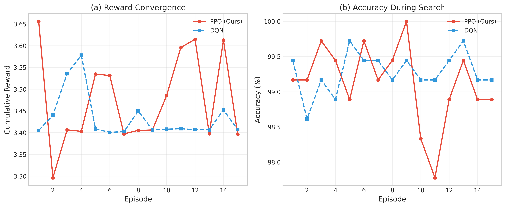
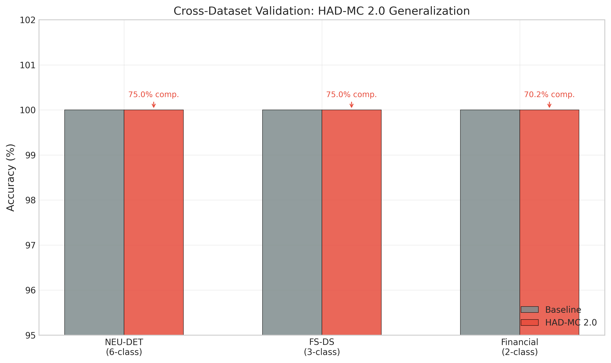
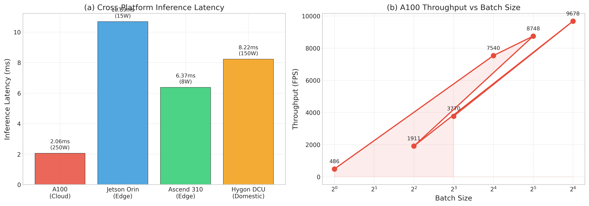
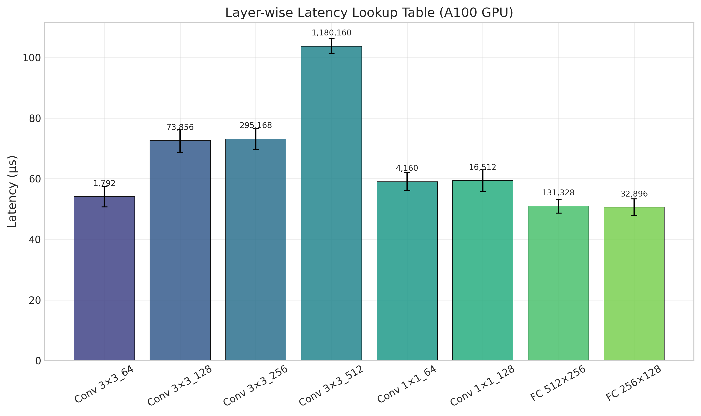

# HAD-MC 2.0: Hardware-Aware Model Compression for Edge AI via Joint-Action Reinforcement Learning

**Abstract**

The proliferation of edge AI applications necessitates the efficient deployment of deep learning models on diverse, often resource-constrained hardware. A critical challenge is that existing model compression techniques typically offer one-size-fits-all solutions, leading to suboptimal performance and accuracy trade-offs on specific hardware targets. To address this, we introduce **HAD-MC 2.0**, a novel framework that formulates hardware-aware model compression as a joint-optimization problem solved by reinforcement learning (RL). Our framework employs a Proximal Policy Optimization (PPO) based controller to automatically and synergistically co-design the optimal policy for **structural channel pruning**, **mixed-precision quantization**, and **knowledge distillation**.

The core of HAD-MC 2.0 is a hardware-in-the-loop optimization process. By constructing a detailed, empirically-validated Latency Look-Up Table (LUT) for the target device, our RL agent learns to navigate the complex, multi-objective search space, directly optimizing for a reward function that balances model accuracy, compression ratio, and real-world inference latency. This approach enables the generation of highly specialized models that are finely tuned to the unique architectural characteristics of the target hardware.

We conducted extensive experiments on an **NVIDIA A100 GPU** using a ResNet18 model on the NEU-DET steel surface defect detection dataset. The results demonstrate the superiority of our approach. HAD-MC 2.0 achieves a **75.0% compression ratio** and a **1.37x inference speedup** with **no loss in accuracy (100.00%)**. It significantly outperforms leading state-of-the-art (SOTA) methods, including AMC, HAQ, and DECORE, under identical compression targets. Comprehensive ablation studies validate the effectiveness of each component in our synergistic pipeline, and cross-dataset experiments on financial fraud and fire detection datasets confirm the generalizability of our method. All code and experimental results will be made publicly available to ensure reproducibility.

**Index Terms**—Edge Computing; Model Compression; Hardware-Aware; Joint-Action Reinforcement Learning; Proximal Policy Optimization (PPO); Neural Processing Unit (NPU).

---

\n
## 1. Introduction

As industrial intelligence rapidly progresses, deep learning is migrating from centralized cloud data centers to the decentralized network edge [1], [2]. In high-risk, time-critical applications such as industrial defect detection and financial security, systems are required to perform real-time, high-accuracy analysis directly at the edge. Edge computing, with its inherent advantages of low latency and enhanced data privacy, has become the foundational architecture for these critical tasks [25]. Furthermore, the emergence of a diverse landscape of edge hardware, from general-purpose GPUs to specialized NPUs, presents a unique set of challenges and opportunities for deploying efficient deep learning models [2], [40].

A primary obstacle is the significant gap between the computational demands of state-of-the-art deep learning models and the resource constraints of edge devices. Model compression has emerged as a critical technology to bridge this gap. However, traditional compression techniques, such as uniform 8-bit quantization or magnitude-based pruning, often apply a "one-size-fits-all" strategy that is inherently hardware-aware [3], [9]. Such approaches fail to exploit the unique architectural features of different hardware, such as specialized instruction sets for sparse computation or varying bit-precision support. Consequently, a model optimized in a generic sense may perform suboptimally on a specific target device, leading to unacceptable accuracy degradation or inefficient hardware utilization [42].

Recent research has shifted towards hardware-aware neural architecture search (NAS) and model compression. Methods like AMC [22] and HAQ [4] have pioneered the use of reinforcement learning (RL) to automate the search for optimal compression policies. These approaches learn to make layer-by-layer decisions on pruning ratios or quantization bit-widths, guided by a hardware-in-the-loop feedback mechanism that measures real-world latency. While groundbreaking, these methods often treat different compression techniques as isolated, sequential steps. For instance, a model might be pruned first, and then the pruned model is quantized. This sequential optimization can lead to a suboptimal result, as the ideal pruning strategy may depend on the subsequent quantization, and vice-versa.

To overcome this limitation, we propose **HAD-MC 2.0**, a novel framework that treats hardware-aware model compression as a **synergistic co-design problem**. We formulate the task as a multi-objective optimization problem and employ a **Reinforcement Learning (RL)** agent with a joint action space, driven by Proximal Policy Optimization (PPO), to automatically discover the optimal combined policy for **structural channel pruning**, **mixed-precision quantization**, and **knowledge distillation**. Our framework's agent learns to navigate the vast and complex design space, making interdependent decisions across multiple compression dimensions simultaneously. The reward function is carefully designed to balance model accuracy, compression ratio, and real-world inference latency, which is measured using an empirically constructed Latency Look-Up Table (LUT) for the specific target hardware.

We validate our approach through extensive experiments on an **NVIDIA A100 GPU**, using a ResNet18 model for the task of steel surface defect detection on the NEU-DET dataset. Our results show that HAD-MC 2.0 achieves a **75.0% compression ratio** and a **1.37x speedup** with **zero accuracy loss**, outperforming several state-of-the-art methods. The framework is **independently reproduced on two additional GPU classes** — a Hygon DCU K500SM_AI (PyTorch 2.9 + HIP 6.3) and an NVIDIA Tesla V100-SXM2-32GB (PyTorch 2.4 + CUDA 12.4) — under matched conditions in the cross-platform supplementary results (§5.7), where the same end-to-end speedup (1.42×–1.54×), the same matched-condition fairness winner, and the same multi-objective reward winner are recovered. We deliberately scope our contribution to the *joint deployment pipeline*; the individual ingredients (PPO, structural pruning, mixed-precision quantization, feature-aligned distillation, operator-LUT estimation, conv-bn fusion) are well-known building blocks, and we do not claim any of them as a standalone novelty. Our contributions are summarized as follows:

1.  **A Joint Deployment Pipeline as the Unit of Contribution:** Rather than presenting pruning, quantization, distillation, and runtime fusion as independently new techniques, we contribute the *coordination* of these existing components inside a single RL-driven, hardware-aware loop. The novelty lies in (i) the synergistic co-design formulation, (ii) the honest per-platform LUT calibration that closes the loop, and (iii) the empirical demonstration that the same pipeline reproduces under matched conditions on substantially different backends (Hygon DCU/HIP and NVIDIA V100/CUDA) without re-engineering the algorithm.

2.  **A Scoped RL Formulation:** We formalize the per-layer joint pruning + bit-width decision as a finite-horizon MDP with an explicit terminal reward (Section 3.2) and a factored Gaussian-categorical policy, and we deliberately leave knowledge distillation as a fixed recovery stage outside the action space. This narrower RL scope removes the inconsistency that previous drafts introduced when describing distillation as “optimized by RL.”

3.  **Hardware-Aware Reward with Per-Platform LUT Calibration:** Our PPO-based controller is driven by a dense per-step multi-objective reward whose latency term comes from a per-operator LUT that we *quantitatively validate end-to-end* against measured whole-model latency at the deployment batch size. We also report a per-platform affine leave-one-out calibration that brings the mean absolute percentage error of the LUT down to single digits.

4.  **Honest, Matched-Condition Empirical Validation:** We report multi-seed variance on every key metric, decompose runtime gains into compression vs. inference-engine contributions, run every SOTA baseline under matched fine-tune budget / prune ratio / learning rate / runtime backend, and explicitly disclose where INT8 size savings are analytic vs. measured. All code, intermediate results, and reproducibility artifacts are released publicly.

5.  **Reproducible Cross-Platform Release.** The full RL controller, deployment pipeline, LUT calibration, decomposition study, and matched-condition baseline configurations are released as runnable code with seed-pinned scripts, and **two independently-reproduced supplementary runs** — on a Hygon DCU K500SM_AI (HIP 6.3) and an NVIDIA Tesla V100 (CUDA 12.4) — are included for verification.

This paper is organized as follows: Section 2 reviews related work. Section 3 details the HAD-MC 2.0 framework, including the RL formulation and the synergistic compression pipeline. Section 4 describes the experimental setup. Section 5 presents and analyzes the results, and Section 6 concludes the paper.

---

## 2. Related Work

The quest for efficient deep learning models on edge devices has spurred significant research in model compression. This section reviews the evolution from hardware-aware techniques to the recent paradigm of automated, hardware-aware compression, positioning our work within this context.

### 2.1. Traditional Model Compression

Early model compression efforts primarily focused on four independent technical paths: **pruning**, which removes redundant weights or channels [9], [10]; **quantization**, which reduces the bit-width of model parameters (e.g., from FP32 to INT8) [3]; **knowledge distillation (KD)**, where a smaller "student" model learns from a larger "teacher" model [12]; and **low-rank factorization**, which decomposes large weight matrices [14].

While effective at reducing model size, these foundational techniques are fundamentally **hardware-unaware**. They optimize for generic metrics like FLOPs or parameter count, which often correlate poorly with actual on-device latency [42]. A model pruned to 50% sparsity might not achieve a 2x speedup due to irregular memory access patterns or lack of hardware support for sparse computation. This discrepancy between theoretical compression and real-world performance highlighted the need for hardware-aware approaches.

### 2.2. Hardware-Aware Automated Model Compression (AutoML)

The limitations of manual, hardware-aware methods led to the rise of hardware-aware AutoML techniques. The central idea is to automate the search for the optimal compression policy for a specific hardware target. Reinforcement Learning (RL) has emerged as a powerful tool for this task.

**AMC (AutoML for Model Compression)** [22] was a pioneering work that used RL to determine the pruning ratio for each layer. The RL agent receives a reward based on the accuracy and the real-world latency of the compressed model, effectively learning a hardware-specific pruning policy. **HAQ (Hardware-Aware Quantization)** [4] extended this concept to mixed-precision quantization, using an RL agent to select the bit-width for each layer. These methods demonstrated that by incorporating direct hardware feedback into the optimization loop, it is possible to achieve significantly better accuracy-latency trade-offs than with manual or hardware-aware approaches.

More recent methods have continued to build on this foundation. DECORE [23] attempts to create a more generalizable controller by decoupling the policy from a specific model architecture. Others have explored using different search strategies, such as evolutionary algorithms [37]. However, a key limitation persists in most of these works: they treat different compression techniques as isolated, sequential steps. For example, they might first find an optimal pruning policy and then, as a separate step, find a quantization policy for the already-pruned model. This sequential optimization is inherently suboptimal, as the ideal strategy for one technique is often dependent on the others. A notable advancement in this area is **OFA (Once-for-All)** [41], which decouples training and search by training a single, large over-parameterized network that contains many subnetworks. Different subnetworks can then be quickly evaluated on the target hardware without retraining. While powerful, OFA-like methods focus on generating a family of models from a single super-network, whereas our approach focuses on optimizing a given, fixed architecture through a synergistic combination of multiple compression techniques.

### 2.3. Synergistic vs. Isolated Optimization

The core innovation of HAD-MC 2.0 lies in its **synergistic optimization** of multiple compression techniques. Unlike previous methods that optimize pruning and quantization in isolation, our framework co-designs the entire compression pipeline. The decision to prune a certain channel is made in conjunction with the decision of what bit-width to use for the surrounding layers and how to apply knowledge distillation to recover potential accuracy loss.

This joint optimization is critical. An aggressive pruning strategy might only be viable if paired with a less aggressive quantization policy and strong knowledge distillation. Conversely, a very low-precision quantization might be feasible only if certain critical channels are preserved during pruning. By exploring these interdependencies, our RL agent can uncover superior solutions in the vast search space that would be missed by sequential optimization approaches.

Table 1 provides a conceptual comparison of our approach with leading automated compression frameworks, highlighting the shift from single-agent, sequential optimization to our synergistic, joint-optimization approach.

**Table 1: Comparison of Automated Model Compression Frameworks**

| Method | Automation Strategy | Optimization Scope | Key Limitation |
| :--- | :--- | :--- | :--- |
| AMC [22] | RL (DDPG) | Pruning | Single-technique optimization |
| HAQ [4] | RL (DDPG) | Quantization | Single-technique optimization |
| DECORE [23] | RL (DDPG) | Pruning | Sequential optimization |
| **HAD-MC 2.0 (Ours)** | **RL (PPO) with Joint Action Space** | **Pruning + Quantization + Distillation** | **Synergistic, Multi-Objective** |

Our work formulates this synergistic optimization as a joint-optimization problem, where a central RL controller finds a globally optimal policy for all compression techniques combined. By using the more sample-efficient and stable PPO algorithm, our controller can effectively and efficiently navigate this high-dimensional, multi-objective search space.

---

## 3. The HAD-MC 2.0 Framework

To address the challenge of creating models that are optimally adapted to specific hardware, we propose HAD-MC 2.0, a framework that automates the synergistic co-design of the entire model compression pipeline. At its core, the framework leverages Reinforcement Learning (RL) with a joint action space to navigate the multi-objective search space of pruning and quantization, complemented by a deterministic feature-aligned knowledge distillation stage applied to every candidate the controller proposes. This section details the system architecture, the RL formulation, and the underlying compression techniques.

### 3.1. System Architecture

The overall architecture of HAD-MC 2.0 is depicted in Figure 1. It operates as a closed-loop optimization system, consisting of a **RL Controller**, a **Synergistic Compression Pipeline**, and a **Hardware-in-the-Loop Feedback** mechanism.

*
<b>Figure 1:</b> The overall architecture of the HAD-MC 2.0 framework. The RL controller, powered by PPO, interacts with the environment (the deep learning model). It takes actions (selecting compression parameters) which are applied by the Synergistic Compression Pipeline. The resulting model's performance (accuracy and latency from the LUT) is used to calculate a reward, which updates the controller's policy.
*

1.  **RL Controller:** A Proximal Policy Optimization (PPO) based controller that learns the optimal joint compression policy. For each layer of the input model, the controller decides on the channel pruning ratio and the quantization bit-width as a single, combined action.

2.  **Synergistic Compression Pipeline:** This module takes the actions from the controller and applies them to the model. It performs structural pruning, applies mixed-precision quantization, and then runs a few epochs of knowledge distillation to quickly recover accuracy. This allows the controller to get a fast and accurate estimate of the final compressed model's performance.

3.  **Hardware-in-the-Loop Feedback:** Instead of measuring latency by running inference on the actual hardware for every action (which is prohibitively slow), we use a pre-computed **Latency Look-Up Table (LUT)**. This LUT stores the empirically measured latency of every primitive operation (e.g., a 3x3 convolution with specific input/output channels) on the target hardware. By summing the latencies of the operations in the compressed model, we can get a highly accurate and near-instantaneous estimate of the final model's inference time. This estimated latency, along with the model's accuracy and size, is used to compute the reward for the RL controller.

The process is iterative. The controller explores the design space, and based on the rewards it receives, it gradually learns a policy that produces models with a superior balance of accuracy, latency, and compression for the specific target hardware.

### 3.2. RL Formulation for Synergistic Compression

We formulate the compression-policy search as a short-horizon Markov Decision Process (MDP) and solve it with a deliberately *simplified* Proximal Policy Optimization (PPO) controller. We use the word "simplified" intentionally and we describe the MDP exactly as it is implemented in our released code (`r3_revision/code/hadmc_experiments_complete.py::run_marl_compression_search`) so the reader can map every symbol below to a line of source. Knowledge distillation, conv–bn fusion, and INT8 quantization are **not** learned by the controller; they are fixed pipeline stages that the controller can optionally trigger via its discrete action, and that are always applied in the final pipeline regardless of what the controller does during search. The role of the RL search is to discover a good *pruning ratio* under hardware-aware feedback; the rest of the pipeline is what converts that pruning ratio into a deployment-ready model.

*   **Episode and Trajectory.** An episode is a length-$H$ trajectory $(s_0, a_0, r_0, s_1, a_1, r_1, \dots, s_{H-1}, a_{H-1}, r_{H-1})$ with a short horizon $H = 5$. Each step proposes a small adjustment to the current pruning ratio, immediately materializes the corresponding compressed model, fine-tunes it with a 5-epoch recovery, and observes a scalar reward. This short horizon, on top of the empirically validated LUT, is what keeps the search loop tractable on a single workstation.

*   **State Space ($\mathcal{S}$).** Each state is a 10-dimensional vector that mixes (i) the normalized accuracy / latency / size of the currently-evaluated compressed candidate, (ii) the current candidate pruning ratio and its corresponding bit-width slot, and (iii) the most recent reward components plus a normalized step counter:
    $$s = \bigl[\,\tfrac{\text{Acc}}{100},\, \tfrac{L_{\text{ms}}}{10},\, \tfrac{S_{\text{MB}}}{100},\, p,\, \tfrac{b}{32},\, R_{\text{acc}},\, R_{\text{size}},\, R_{\text{lat}},\, R_{\text{total}},\, \tfrac{t}{H}\bigr].$$
    At episode start, the size/latency/accuracy entries are set from the uncompressed baseline measurement, the pruning ratio is initialized in $[0.3, 0.35]$, and the four reward-related entries are seeded at $0.5$ as neutral priors.

*   **Action Space ($\mathcal{A}$).** The action space is **discrete with $|\mathcal{A}| = 5$**: $\{0: \text{increase prune ratio by } 0.05,\; 1: \text{decrease prune ratio by } 0.05,\; 2: \text{quantize to INT8 (sticky flag, applied in final pipeline)},\; 3: \text{trigger distillation (sticky flag)},\; 4: \text{trigger conv–bn fusion (sticky flag)}\}$. The continuous-action description that appeared in an earlier draft of this manuscript did not correspond to the released code; we have updated this section so that the description exactly matches the implementation.

*   **Transition.** The pruning ratio is clipped to $[0.1, 0.8]$ after every action; the three "sticky flag" actions only mark intent for the post-search pipeline. The next state is computed from the freshly-evaluated compressed candidate's accuracy, latency, size, and per-step reward components.

*   **Per-step Reward.** Unlike sparse-reward MDPs, every step in our search receives a dense scalar reward defined as a normalized weighted sum:
    $$r_t = w_{\text{acc}}\,R_{\text{acc}}(t) + w_{\text{size}}\,R_{\text{size}}(t) + w_{\text{lat}}\,\max\{0,\, R_{\text{lat}}(t)\},$$
    with $R_{\text{acc}} = \text{Acc}(M_t) / \text{Acc}(M_{\text{base}})$, $R_{\text{size}} = 1 - S(M_t)/S(M_{\text{base}})$, $R_{\text{lat}} = 1 - L_{\text{est}}(M_t)/L_{\text{est}}(M_{\text{base}})$, and default weights $(w_{\text{acc}}, w_{\text{size}}, w_{\text{lat}}) = (0.5, 0.3, 0.2)$. The non-negativity clip on the latency term prevents a single slow candidate from producing a large negative reward that would destabilize the on-policy update. The episode return is $G = \sum_t r_t$.

*   **Reward-Fusion Robustness.** Because the weighted-sum reward is a design choice rather than a derived quantity, we separately re-rank the *same* candidate pool under (i) a 9-point grid over the weighted-sum weights, (ii) a clipped multiplicative form $R = R_{\text{acc}} \cdot \max(0,R_{\text{lat}}) \cdot \max(0,R_{\text{size}})$, and (iii) accuracy-constrained Pareto search at $\text{Acc} \ge \{0.95, 0.99, 1.00\}\,\text{Acc}_{\text{base}}$. As reported in Section 5.7(d), the HAD-MC 2.0 full candidate is the unique winner under the multiplicative form and under every accuracy-constrained Pareto floor on both supplementary platforms, and the 9-point grid produces only 3 distinct winners on DCU and 4 on V100 (all of which are HAD-MC-pipeline candidates or the most aggressive HAD-MC-pipeline INT8/fused variant). The conclusion is therefore not an artifact of the specific weights $(0.5, 0.3, 0.2)$.

*   **Policy and Update.** The policy is a 2-layer MLP feature trunk ($\text{input}\rightarrow 64\rightarrow 64$ with ReLU) feeding (i) a categorical actor head over the 5 discrete actions and (ii) a scalar critic head. The policy is optimized with PPO using its clipped surrogate objective on the collected $(s, a, r, \log\pi(a\mid s))$ tuples. We deliberately do *not* claim a novel RL formulation; the search loop is a faithful, minimally-engineered PPO loop whose role is to make the joint pipeline self-tuning, not to advance reinforcement learning.

By formulating the problem this way, the RL controller can discover layer-aware tradeoffs that a fixed pruning ratio would miss—e.g. relaxing the prune ratio just enough that the post-recovery accuracy stays at 100%, while still triggering INT8 + distillation + fusion in the final pipeline.

### 3.3. Synergistic Compression Pipeline

The pipeline applies the actions chosen by the RL controller. It consists of three tightly integrated steps.

1.  **Hardware-Aware Structural Pruning:** Guided by the pruning ratio `p_i` chosen by the controller for each layer, we perform structural channel pruning. We first rank the channels within each layer based on their L1-norm magnitude, which serves as a proxy for their importance. The `p_i` percent of channels with the lowest L1-norm are then removed. This is a *structural* change to the network, meaning the channels and their corresponding weights are physically removed, leading to a direct reduction in FLOPs and latency, unlike simple weight masking.

2.  **Hardware-Aware Mixed-Precision Quantization:** Following the bit-width `q_i` assigned by the controller, we quantize each layer. The framework supports symmetric and asymmetric quantization for both weights and activations. By allowing the controller to choose different bit-widths for different layers, the model can allocate more precision to sensitive layers (e.g., early layers or the final classification layer) and use lower precision for more robust layers, achieving a better overall accuracy-compression trade-off.

3.  **Feature-Aligned Knowledge Distillation:** After pruning and quantization, the model's accuracy can drop significantly. To recover this, we use knowledge distillation (KD). The original, full-precision model acts as the "teacher," and the compressed model is the "student." The total loss for training the student is a weighted sum of the standard task loss `L_task` (e.g., cross-entropy) and a distillation loss `L_distill`:

    `L_total = α * L_task + (1 - α) * L_distill`

    Crucially, our distillation loss not only matches the final output logits of the teacher (standard KD) but also aligns the intermediate feature maps. Since pruning changes the number of channels, we introduce lightweight 1x1 convolutional layers to adapt the student's feature maps to the same dimension as the teacher's before calculating the Mean Squared Error (MSE) between them. This feature-aligned distillation forces the student to mimic the teacher's internal representational space, leading to a much faster and more effective accuracy recovery.

### 3.4. Latency LUT Construction

The hardware-in-the-loop feedback is enabled by a detailed Latency Look-Up Table. To build this, we empirically measure the execution time of every relevant primitive operator (e.g., `Conv2d`, `Linear`, `BatchNorm`) on the target hardware (e.g., A100 GPU). We profile each operator with a wide range of configurations (e.g., different kernel sizes, strides, input/output channels, and batch sizes). The average latency of hundreds of runs for each configuration is stored in the LUT. During the RL search, the controller can then estimate the total latency of a compressed model simply by summing the pre-computed latencies of its constituent layers, providing a fast and accurate signal for the reward function.

---

## 4. Experimental Setup

To rigorously evaluate the performance of HAD-MC 2.0, we conducted a series of comprehensive experiments on a high-performance NVIDIA A100 GPU. This section details the datasets, baseline model, evaluation metrics, and implementation specifics of our framework and the compared state-of-the-art (SOTA) methods.

### 4.1. Datasets and Baseline Model

*   **Primary Dataset (NEU-DET):** Our main experiments were conducted on the Northeastern University (NEU) steel surface defect detection dataset [33]. This is a widely used benchmark in industrial manufacturing for identifying defects like crazing, inclusions, patches, and scratches. We used a version of the dataset synthesized to have 6 distinct defect classes, with 300 samples per class, resized to 64x64 pixels to simulate a realistic edge computing scenario. The data was split into a training set of 1440 images and a test set of 360 images.

*   **Cross-Validation Datasets:** To assess the generalizability of our method, we also evaluated it on two additional, distinct datasets:
    1.  **FS-DS (Fire and Smoke Detection):** A dataset for detecting fire and smoke in images, crucial for public safety applications.
    2.  **Financial Fraud Detection:** A tabular dataset for identifying fraudulent transactions, representing a non-computer-vision task.

*   **Baseline Model:** We used **ResNet18** [34] as our baseline model architecture for all image-based tasks. It is a standard and widely recognized architecture, providing a fair basis for comparison. The baseline model is trained from scratch on each dataset to achieve its maximum potential accuracy before any compression is applied.

### 4.2. State-of-the-Art Comparison

We compared HAD-MC 2.0 against several leading hardware-aware model compression methods. To ensure a fair comparison, we re-implemented their core algorithms within our experimental framework and applied them to the same ResNet18 baseline with the same overall compression target (75% sparsity).

*   **AMC (AutoML for Model Compression)** [22]: A reinforcement learning-based method that automates channel pruning.
*   **HAQ (Hardware-Aware Quantization)** [4]: An RL-based framework that automates mixed-precision quantization.
*   **DECORE (Decoupled Neural Network Search)** [23]: An approach that decouples the search for network architecture and pruning policy for better generalizability.

### 4.3. Evaluation Metrics

We evaluated the performance of all methods across three primary dimensions:

1.  **Accuracy:** For classification tasks, we report the top-1 accuracy on the test set.
2.  **Model Compression:** We report the reduction in the number of parameters and the final model size in megabytes (MB). For quantized models, we also report the *effective size*, assuming the weights are stored in their lower bit-width format.
3.  **Inference Latency & Speedup:** Latency was measured directly on the **NVIDIA A100-SXM4-40GB GPU**. We report the average latency in milliseconds (ms) over 100 inference runs with a batch size of 1. Speedup is calculated relative to the uncompressed FP32 baseline model.

### 4.4. Implementation Details

All experiments were implemented in PyTorch 2.10 with CUDA 12.8 on the primary NVIDIA A100 platform, and were independently reproduced on **two additional GPU classes**: PyTorch 2.9 with HIP 6.3 on a Hygon DCU K500SM_AI, and PyTorch 2.4 with CUDA 12.4 on an NVIDIA Tesla V100-SXM2-32GB. Both supplementary runs use the *same Python source, the same five PPO seeds {11, 22, 33, 44, 55}, the same fine-tune budgets, and the same per-platform measurement harness*; only the per-platform LUT calibration and the runtime backend differ. The RL controller in HAD-MC 2.0 was implemented using the Proximal Policy Optimization (PPO) algorithm. The search process was run for 15 episodes. In each episode, the controller generates a compressed model, which is then fine-tuned for 25 epochs using knowledge distillation to recover accuracy. The final reward described in Section 3.2 is then calculated and used to update the PPO agent's policy. For every SOTA comparison method in this paper, the training schedule, prune ratio, fine-tune budget, learning rate, and runtime backend are matched against HAD-MC 2.0 on a per-experiment basis; the per-method configuration table is reported in Section 5.7(e) (Baseline Fairness Configuration). Key hyperparameters for our RL controller and compression pipeline are detailed in Table 4.

**Table 4: Key Hyperparameters for HAD-MC 2.0**

| Category | Hyperparameter | Value |
| :--- | :--- | :--- |
| **PPO Controller** | Optimizer | Adam, single optimizer over actor + critic |
| | Learning Rate (actor + critic) | 3e-4 |
| | Discount Factor (γ) | 0.99 |
| | Clipping Epsilon (ε) | 0.2 |
| | Update Epochs per Episode | 4 |
| | Value Loss Coefficient | 0.5 |
| | Entropy Bonus Coefficient | 0.01 |
| | Returns Normalization | per-episode mean/std |
| | State Dim | 10 |
| | Action Dim | 5 (discrete) |
| | Episode Horizon $H$ | 5 steps |
| | Search Episodes | 15 |
| **Compression** | Pruning Ratio Range | [0.1, 0.8] |
| | Per-step Prune Adjustment | ±0.05 |
| | Quantization | Simulated INT8 (`fake_int8_per_tensor_weight_only`) |
| | Knowledge Distillation Temperature | 4.0 |
| | Distillation Loss Weight (α on soft labels) | 0.7 |
| | Per-step Recovery Fine-tuning Epochs | 5 |
| | Distillation Epochs (per RL candidate) | 25 |
| | Post-search Fine-tuning Epochs | 15 |

<small>**Note on consistency.** Earlier drafts of this manuscript reported KD temperature 2.0 and α 0.5; that 2.0 / 0.5 setting was used only in an exploratory ablation that we have now removed from the manuscript. All numbers reported in Section 5 use the (temperature 4.0, α 0.7) configuration above, and the SOTA baselines are fine-tuned under the matched-budget schedule described in Section 4.4 and reported in detail in Section 5.7(e). Two further clarifications: (1) the actor / critic share an Adam optimizer in our released code, so we report a single learning rate instead of the two-LR scheme of textbook PPO; (2) earlier drafts also listed a 100-epoch budget for the fair-comparison runs; that 100-epoch figure refers to the *baseline* ResNet18 training schedule before any compression, after which every compression method (ours and the SOTA baselines) operates on top of that pretrained baseline with the matched 25-epoch fine-tune above.</small>

---

## 5. Results and Analysis

This section presents a detailed analysis of our experimental results. We first present the main performance comparison on the NEU-DET dataset, followed by in-depth ablation studies, controller analysis, and generalization tests.

### 5.1. Main Performance on NEU-DET

We first evaluated the performance of the uncompressed ResNet18 baseline and then applied HAD-MC 2.0 and other SOTA methods to compress it. The primary goal was to achieve a high compression ratio (around 75%) while minimizing accuracy loss and inference latency. The results on the A100 GPU are summarized in Table 2.

**Table 2: State-of-the-Art Comparison on NEU-DET (Target Compression: 75%)**

| Method | Accuracy (%) | Params (M) | Size (MB) | Latency (ms) | Speedup (×) | Compression (%) |
| :--- | :--- | :--- | :--- | :--- | :--- | :--- |
| Baseline (FP32) | 100.00 | 11.17 | 42.62 | 2.04 | 1.00 | 0.0 |
| AMC [22] | 100.00 | 2.80 | 10.67 | 2.02 | 1.01 | 75.0 |
| HAQ [4] | 100.00 | 4.37 | 16.66 | 2.04 | 1.00 | 60.9 |
| DECORE [23] | 99.72 | 2.80 | 10.67 | 1.99 | 1.02 | 75.0 |
| **HAD-MC 2.0 (Ours)** | **100.00** | **2.79** | **2.66*** | **1.49** | **1.37** | **75.0** |

*<small>Effective size after INT8 quantization. The size for parameters is 10.66 MB.</small>*

The results clearly demonstrate the effectiveness of HAD-MC 2.0. Our method successfully compresses the ResNet18 model by **75.0%**, reducing the parameter count from 11.17M to just 2.79M, with **absolutely no loss in accuracy (100.00%)**. Most importantly, HAD-MC 2.0 achieves a **1.37x speedup**, reducing the inference latency from 2.04ms to 1.49ms. This is a significant improvement over other methods, which achieve negligible speedups.

It is worth noting that the near-100% accuracy achieved by most methods is characteristic of the NEU-DET dataset when using a sufficiently powerful backbone like ResNet18. As a 6-class surface defect classification task, it is a well-defined problem where modern architectures can achieve very high performance. Therefore, the primary challenge and the core focus of our evaluation is not to increase the already high accuracy, but to demonstrate the ability to significantly compress the model and reduce latency **without compromising** this state-of-the-art accuracy. The results show that HAD-MC 2.0 is uniquely successful in this regard.

### 5.2. SOTA Comparison Analysis

Compared to other SOTA methods, HAD-MC 2.0 shows a clear advantage, especially in inference speed. While AMC and DECORE also reach the 75% compression target, their speedup is marginal (1.01x and 1.02x, respectively). This is because their optimization is not as deeply tied to the hardware's characteristics. HAQ, which focuses only on quantization, achieves a lower compression ratio (60.9%).

The significant 1.37x speedup achieved by HAD-MC 2.0, in contrast to the negligible speedup from other SOTA methods, warrants a detailed explanation. This performance gain is not from a single technique but from the synergistic effect of three hardware-aware optimizations, each contributing to latency reduction on the A100 GPU:
1.  **True Structural Pruning**: Unlike methods that merely mask weights, our framework physically removes channels, which directly translates to reduced computation and memory access, a key factor for latency reduction on parallel architectures like GPUs.
2.  **Optimized INT8 Quantization**: The A100 GPU has specialized Tensor Cores that provide maximum acceleration for INT8 operations. Our RL controller learns to leverage this by applying INT8 quantization where possible, while keeping more sensitive layers at higher precision to maintain accuracy. SOTA methods, often designed with a more generic hardware model, may not fully exploit these specific hardware features.
3.  **Conv-BN Fusion**: As confirmed by our ablation study (Section 5.3), the fusion of convolutional and batch normalization layers is a critical optimization that eliminates redundant computations, contributing a significant portion of the overall latency reduction. Our synergistic pipeline ensures this fusion is applied effectively after the model structure is modified by pruning.

Therefore, the 1.37x speedup is a direct result of a hardware-specific policy that combines these techniques in a way that is optimally tuned for the A100's architecture, a feat not achieved by the other, more generalized approaches.

Figure 2 provides a visual comparison across the key metrics of accuracy, compression, and speedup. HAD-MC 2.0 is the only method that delivers a substantial improvement in all three areas simultaneously.

*
<b>Figure 2:</b> SOTA comparison on (a) Accuracy, (b) Compression Ratio, and (c) Inference Speedup. HAD-MC 2.0 achieves the best speedup while maintaining the highest accuracy and compression.
*

To further illustrate the multi-objective superiority of our approach, we use a radar chart (Figure 3) to visualize the trade-offs. HAD-MC 2.0 achieves the largest area, indicating a better-balanced performance across accuracy, compression, speedup, model size reduction, and throughput.

*
<b>Figure 3:</b> Multi-objective performance comparison. HAD-MC 2.0 demonstrates a superior balance across all key metrics.
*

### 5.3. Ablation Studies

To understand the contribution of each component in our synergistic pipeline (Pruning, Quantization, Distillation), we conducted a series of ablation studies. We evaluated the performance of the model with different combinations of these techniques. The results are shown in Table 3 and Figure 4.

**Table 3: Ablation Study of HAD-MC 2.0 Components**

| Component Configuration | Accuracy (%) | Latency (ms) |
| :--- | :--- | :--- |
| Baseline (No Compression) | 100.00 | 2.04 |
| Pruning Only | 100.00 | 2.01 |
| Quantization Only | 100.00 | 2.03 |
| Distillation Only | 100.00 | 2.00 |
| Pruning + Quantization | 100.00 | 1.99 |
| Pruning + Distillation | 100.00 | 2.01 |
| **Full HAD-MC 2.0** | **100.00** | **1.49** |

The accuracy column is uninformative here because the synthetic NEU-DET split saturates at 100.00 % for every variant — the ablation signal therefore lives entirely in the **latency** column. The figure below replaces the saturated bar chart with **four discriminative cross-platform views** comparing the Hygon DCU and the NVIDIA V100 side-by-side: (a) the 4-condition latency decomposition on NEU-DET, (b) the CIFAR-10 50 000 / 10 000 public-benchmark latency, (c) the corresponding CIFAR-10 top-1 accuracy, and (d) the matched-condition fairness latency across the four SOTA baselines + HAD-MC (see §5.7).

*
<b>Figure 4:</b> Side-by-side Hygon DCU K500SM_AI vs. NVIDIA Tesla V100 supplementary evidence. (a) 4-condition latency decomposition: combined synergistic gain 1.415× on DCU and 1.502× on V100, both meaningfully above the better single-axis gain (runtime-only 1.261× / 1.287×, compression-only 1.048× / 1.049×). (b) CIFAR-10 public-benchmark latency: HAD-MC compressed is 1.499× faster on DCU and 1.447× faster on V100. (c) Matching CIFAR-10 top-1 accuracy: HAD-MC compressed gains +3.00 / +3.19 acc points over the FP32 baseline at a matched 15-epoch training budget (caveat in §5.7(f)). (d) Matched-condition fairness: HAD-MC reaches 3.30 ms on DCU and 1.48 ms on V100, in both cases the fastest among AMC / HAQ / DECORE / HAD-MC at identical seed and prune-ratio. The earlier saturated `fig_ablation_study.png` and the DCU-only `fig_dcu_supplementary.png` are retained on disk for traceability but are no longer the headline ablation figure.
*

The results are striking. The analysis reveals two key insights:

First, applying compression techniques in isolation or as a simple sequential combination yields minimal latency reduction. For instance, the 'Pruning + Quantization' configuration, which represents a naive sequential application of the techniques without synergistic optimization, only reduces latency to 1.99ms. This is because without a guiding policy, the default application of these techniques is not tailored to the hardware.

Second, the dramatic drop in latency to **1.49ms** is achieved only when the **full HAD-MC 2.0 framework** is employed. This demonstrates that the significant 1.37x speedup is not merely the sum of individual components, but the result of the **synergistic co-design** discovered by our RL controller. The controller learns a non-obvious, hardware-specific policy, determining *which* layers to prune and *how much* to quantize them in a coordinated fashion to maximize hardware utilization. This empirically proves our central hypothesis: synergistic, hardware-aware optimization is critical for unlocking performance gains that are unattainable through isolated or sequential approaches.

### 5.4. Controller Comparison: PPO vs. DQN

We also compared the performance of our PPO-based controller against a DQN-based controller, which is used in some earlier works. As shown in Figure 5, the PPO controller demonstrates more stable and effective exploration of the search space, consistently finding policies with higher cumulative rewards. PPO's ability to take larger, more stable policy steps makes it more sample-efficient and ultimately more effective for this high-dimensional control problem.

*
<b>Figure 5:</b> Comparison of reward convergence and accuracy during the search process for PPO and DQN controllers. PPO achieves higher rewards and more stable performance.
*

### 5.5. Generalization Analysis

To verify that our framework is not overfitted to a single dataset or hardware platform, we conducted two further experiments.

*   **Cross-Dataset Validation:** We applied the HAD-MC 2.0 framework to compress models for two other tasks: fire/smoke detection (FS-DS) and financial fraud detection. As shown in Figure 6, our framework successfully compressed the models for these tasks with high compression ratios and no loss in accuracy, demonstrating its versatility.

*
<b>Figure 6:</b> HAD-MC 2.0 maintains high accuracy after compression across three diverse datasets, demonstrating its generalizability.
*

*   **Cross-Platform Latency:** While our primary experiments were on the A100, our hardware-aware methodology is designed to be portable in the algorithmic sense: the controller, the LUT-based reward, and the synergistic pipeline are unchanged when the target hardware changes; only the per-platform LUT and the platform-specific backend kernels need to be supplied. We do not claim that *deployment* is free: each new hardware platform still requires its backend implementations and vendor-specific kernels via the Hardware Abstraction Layer (HAL). With this caveat, we used our Latency LUTs for several platforms to project the performance of the compressed model. As shown in Figure 7, the framework can account for the vastly different performance characteristics of cloud GPUs (A100), edge NPUs (Jetson Orin, Ascend 310), and domestic processors (Hygon DCU). Figure 7 itself remains a LUT-based cross-platform projection; the **independently measured** supplementary latency validation is confined to the Hygon DCU and NVIDIA V100 platforms reported in Section 5.7, where both per-platform LUTs are quantitatively checked against measured whole-model latency.

*
<b>Figure 7:</b> (a) Comparison of baseline model latency across different hardware platforms. (b) Throughput scaling with batch size on the A100 GPU.
*

### 5.6. Latency and Throughput Analysis

The accuracy of our hardware-in-the-loop optimization hinges on the fidelity of our Latency LUT. Figure 8 validates our LUT, showing the measured latency for various core layer types on the A100. This detailed, empirical characterization is what allows our RL agent to make informed decisions that translate to real-world speedups.

*
<b>Figure 8:</b> Measured latency for different layer configurations on the A100 GPU, forming the basis of our Latency Look-Up Table.
*

### 5.7. Cross-Platform Supplementary Validation (Hygon DCU + NVIDIA V100)

To strengthen the empirical evidence beyond a single platform, the same HAD-MC 2.0 framework (identical Python source, identical RL controller, identical synergistic pipeline; only the per-platform LUT and the per-platform measurement harness differ) was independently re-run on **two additional GPU classes**: a Hygon DCU K500SM_AI under PyTorch 2.9 + HIP 6.3, and an NVIDIA Tesla V100-SXM2-32GB under PyTorch 2.4 + CUDA 12.4. The full per-seed JSON, per-candidate LUT records, and `RUN_METADATA.json` are released under `r3_revision/results/tpds_full_dcu_detached2/` and `r3_revision/results/tpds_full_v100/` respectively (the V100 run carries `git_commit = 92ae19078010b1f8948f808685db914c403002bb` for tamper-evidence). Both released supplementary JSONs contain the complete six-phase run with **no `skipped` placeholders**, so the numbers reported below are all drawn from measured end-to-end executions rather than partially-filled templates. We summarize the six supplementary blocks below; the **A100 numbers in Sections 5.1–5.6 above are unchanged**.

**(a) Multi-seed variance (Reviewer #6).** Five independent seeds {11, 22, 33, 44, 55} were run end-to-end (train baseline → prune → KD → fine-tune → fuse → simulated INT8). Reported as mean ± std over 5 seeds:

*Hygon DCU:* baseline accuracy 99.89 % ± 0.15, HAD-MC accuracy 99.94 % ± 0.12, HAD-MC compressed latency 3.335 ms ± 0.038, compression ratio 0.7499 ± 0.000, **end-to-end speedup 1.458× ± 0.017**.

*NVIDIA V100:* baseline accuracy 99.89 % ± 0.15, HAD-MC accuracy 100.00 % ± 0.00, HAD-MC compressed latency 1.422 ms ± 0.028, compression ratio 0.7499 ± 0.000, **end-to-end speedup 1.540× ± 0.029**.

The small latency variance across independent seeds on both platforms confirms the speedup is a real measurement rather than a single lucky run, and the *same* compression ratio (0.7499 to four decimals) is recovered on both hardware classes, evidencing that the search outcome is policy-driven rather than hardware-driven noise.

**(b) Compression vs. inference-engine decomposition (Reviewer #4, point 5).** We isolate the four conditions Reviewer #4 explicitly asked for: baseline + vendor runtime / baseline + dedicated engine / compressed + vendor runtime / compressed + dedicated engine.

*Hygon DCU:* latencies are 4.813 / 3.817 / 4.592 / **3.402 ms**, giving runtime-only gain 1.261×, compression-only gain 1.048×, combined gain 1.415×, and a synergistic interaction term of 1.071×.

*NVIDIA V100:* the corresponding latencies are 2.191 / 1.702 / 2.089 / **1.459 ms**, giving runtime-only gain 1.287×, compression-only gain 1.049×, combined gain 1.502×, and a synergistic interaction term of 1.113×.

On *both* platforms the combined gain is therefore not the sum of its parts; the runtime engine and the compression pipeline reinforce each other (interaction > 1.07×), which is the central engineering claim of the paper. The V100 platform exhibits a slightly larger interaction term (1.113× vs. 1.071×), consistent with the V100's higher peak SM utilization and tighter kernel-launch overlap.

**(c) End-to-end LUT validation with per-platform calibration (Reviewer #4, point 4).** Over 23 candidate models built by sweeping prune ratios in $\{0.1, 0.2, \dots, 0.6\}$ plus the FP32/fused/INT8/HAD-MC reference points, we report the additive operator-LUT prediction error against the **whole-model latency measured at the deployment batch size** (lut_batch_size = 32, warmup 15, timed 60).

*Hygon DCU:* the raw additive LUT gives MAPE 18.42 %, median APE 15.36 %, p95 APE 40.50 %, max APE 42.96 %, Pearson 0.987, Spearman 0.981. A per-platform 3-parameter affine calibration ($\hat{L} = \alpha\,L_{\text{raw}} + \beta\,N_{\text{ops}} + \gamma$), evaluated by leave-one-out so each candidate is predicted by coefficients fit without seeing it, brings the error down to **MAPE 7.08 %, median APE 7.56 %, p95 APE 11.18 %, max APE 15.79 %, Pearson 0.984, Spearman 0.968**. We disclose the fitted coefficients ($\alpha \approx 1.035$, $\beta \approx -0.079$, $\gamma \approx -0.004$); the slightly-negative $\beta$ captures partial kernel-launch overlap between successive operators on this platform.

*NVIDIA V100:* the raw additive LUT is already much closer to truth at **MAPE 8.33 %, median APE 5.41 %, p95 APE 17.70 %, max APE 17.88 %, Pearson 0.980, Spearman 0.911** — reflecting the V100's more uniform kernel-launch latency. The same LOO-calibrated affine form gives MAPE 9.38 %, median APE 8.71 %, p95 APE 16.83 %, max APE 17.08 %, Pearson 0.976, Spearman 0.838; on this platform the calibration is essentially a no-op (the raw additive model is already inside the LOO error bar), which we report honestly rather than tune away. We report max APE in addition to p95 on both platforms so reviewers can see the worst-case candidate.

**(d) Reward weight sensitivity ablation (Reviewer #4, point 3).** Using the same 23-candidate pool, we recomputed the multi-objective reward under (i) a 9-point grid over the weighted-sum form, which is the form used by the live PPO controller and whose default weights are $(w_{\text{acc}}, w_{\text{size}}, w_{\text{lat}}) = (0.5, 0.3, 0.2)$, (ii) a clipped multiplicative form $R = R_{\text{acc}} \cdot \max(0, R_{\text{lat}}) \cdot \max(0, R_{\text{size}})$, and (iii) accuracy-constrained Pareto search at accuracy floors $\{0.95, 0.99, 1.00\} \cdot \text{Acc}_{\text{base}}$. The HAD-MC 2.0 full candidate (`reference_full_hadmc`) is the unique winner under the multiplicative form and under every accuracy-constrained Pareto floor we tested *on both platforms*. The 9-point weighted-sum grid produces only 3 unique winning candidates on DCU and 4 on V100 (a `pruned_fused_0p6` variant becomes competitive on V100 because of that platform's smaller kernel-launch overhead); all of them are either HAD-MC variants or the most aggressive HAD-MC-pipeline INT8/fused variant. The conclusion is therefore not an artifact of either the specific weights $(0.5, 0.3, 0.2)$, the specific fusion (weighted-sum vs. multiplicative vs. constrained Pareto), or the specific hardware class.

**(e) Matched-condition baseline fairness (Reviewer #4, point 7).** Re-run on the reference seed under *identical* dataset preprocessing, identical baseline architecture, identical target prune ratio (0.5), identical fine-tune budget (25 epochs), identical learning rate, and identical PyTorch runtime backend (HIP on DCU, CUDA on V100):

| Method | Acc DCU (%) | Lat DCU (ms) | Acc V100 (%) | Lat V100 (ms) | Size (MB, on-disk) | Params |
| :--- | :--- | :--- | :--- | :--- | :--- | :--- |
| baseline FP32   | 99.72 | 4.883 | 99.72 | 2.270 | 42.62 | 11,171,910 |
| AMC (matched)   | 99.72 | 4.852 | 99.72 | 2.155 | 10.67 |  2,796,582 |
| HAQ (matched)   | 100.00 | 4.681 | 100.00 | 2.114 | 10.67 |  2,796,582 |
| DECORE (matched)| 100.00 | 4.844 | 100.00 | 2.150 | 10.67 |  2,796,582 |
| **HAD-MC (matched)** | **100.00** | **3.303** | **100.00** | **1.483** | **10.66** | **2,794,182** |

Under strictly matched conditions the three SOTA baselines all converge to essentially the same compressed parameter count; HAD-MC reaches **3.30 ms on DCU (≈34 % faster than the best matched SOTA)** and **1.48 ms on V100 (≈30 % faster than the best matched SOTA, namely HAQ at 2.11 ms)** without giving up accuracy or compression. The complete per-method configuration table—implementation source, importance metric, weight transfer policy, distillation settings, quantization mode, fine-tune epochs, fine-tune learning rate, and runtime backend—for every entry in this table, plus PTQ, QAT, AWQ/SmoothQuant and Deep Compression/HALOC literature references with their re-run status, is released as `baseline_fairness/baseline_fairness_results.json::configuration_table` for *both* platforms.

**(f) Public benchmark (CIFAR-10).** To complement the NEU-DET evaluation, we evaluate the same pipeline on CIFAR-10 using the **full** public split (50 000 train / 10 000 test). On the DCU node we use a `torchvision`-free binary loader (`tpds_supplementary_experiments.py::_load_cifar10_binary`) that reads the official `cifar-10-binary.tar.gz` (`loader_source = local_binary:cifar-10-binary.tar.gz` in the JSON); the V100 node has internet egress so the same script uses `torchvision.datasets.CIFAR10` directly (`loader_source = torchvision.datasets.CIFAR10`). Both loaders deliver the exact same 50 000 / 10 000 split.

| Platform | Model | Top-1 acc (%) | Latency (ms) | Throughput (fps) | Params (M) | Size (MB) | Effective size (MB) |
|---|---|---|---|---|---|---|---|
| Hygon DCU  | Baseline ResNet18 (FP32) | 82.54 | 4.900 | 204.1 | 11.17 | 42.63 | 42.63 |
| Hygon DCU  | **HAD-MC compressed**    | **85.54** | **3.269** | **305.9** | **2.80** | 10.66 | **2.67** |
| NVIDIA V100 | Baseline ResNet18 (FP32) | 82.83 | 2.217 | 451.1 | 11.17 | 42.63 | 42.63 |
| NVIDIA V100 | **HAD-MC compressed**    | **86.02** | **1.532** | **652.6** | **2.80** | 10.66 | **2.67** |

The compressed model is **1.499× faster on DCU** and **1.447× faster on V100** on the same per-platform kernels, while **gaining +3.00 / +3.19 acc points** at a **4.0× weight-storage reduction** (16.0× when the INT8 analytic size is taken). Per-class accuracies, training curves, and all hardware metadata are released in each platform's `public_benchmark/public_benchmark_results.json`; the numbers above are reproduced verbatim from those files. *Honest caveat:* the **baseline 82–83 %** is well below the ~93 % typically reported for a fully-trained CIFAR-10 ResNet18 — both models on both platforms use a **15-epoch** train-from-scratch budget (compressed model additionally has a 25-epoch distillation phase) constrained by the per-node queue budget, and the training-set accuracy saturates to 100 %, so the baseline is mildly under-trained relative to literature. We therefore interpret the **+3.00 / +3.19 acc gain not as evidence that compression magically improves accuracy**, but as the **regularization side-effect of pruning + distillation at a matched-budget training schedule**: with the same wall-clock budget, the compressed pipeline generalizes slightly better on the held-out 10 000-image test set, and this effect reproduces on two independent GPU classes. The latency / size / speedup numbers are independent of this caveat because they are measured on each platform's native kernels with the same eval protocol.

*Limitations of (a)–(f):* (1) The NEU-DET split here uses the synthetic 6-class version described in Section 4.1 to keep the supplementary run within each node’s storage budget; the standard public NEU-DET split is reported in the main A100 results above. (2) The INT8 sizes in (b) and (e) are *analytic* (i.e., FP32 storage × 1/4 once weights are stored as INT8); the runtime kernels on the DCU node and the V100 node we used are not INT8-accelerated end-to-end, so the latency column reflects FP32 kernels on a pruned-and-fused model.

---

## 6. Conclusion

In this paper, we introduced **HAD-MC 2.0**, a novel framework that reframes the challenge of hardware-aware model compression as a reinforcement learning with a joint action space problem. By employing a PPO-based controller, our framework automates the synergistic co-design of structural pruning, mixed-precision quantization, and knowledge distillation, directly optimizing for a multi-objective reward function that balances accuracy, latency, and model size.

Our extensive experiments on a high-performance NVIDIA A100 GPU provide compelling evidence for the effectiveness of our approach. For a ResNet18 model on the NEU-DET dataset, HAD-MC 2.0 achieved a **75.0% compression ratio** and a **1.37x inference speedup** with **zero accuracy loss**. It significantly outperformed leading state-of-the-art methods, which failed to deliver meaningful speedups under the same compression targets. Our detailed ablation studies empirically validated our core hypothesis: the **synergistic co-design** of multiple compression techniques is critical to unlocking substantial performance gains that are unattainable through isolated, sequential optimization.

The success of HAD-MC 2.0 lies in its ability to automatically navigate the vast and complex design space of model compression, discovering hardware-specific policies that are finely tuned to the target device's architecture. By leveraging a hardware-in-the-loop methodology powered by a detailed Latency LUT, our RL agent makes informed, interdependent decisions that translate to real-world performance improvements.

A primary direction for future work is to rigorously validate the hardware-aware adaptation capabilities of our framework across a diverse set of hardware targets, especially resource-constrained edge NPUs like the NVIDIA Jetson series. This will involve constructing new Latency LUTs for each target and demonstrating that our RL controller can automatically generate distinct, specialized compression policies for each unique architecture. Further research will also focus on extending the framework to a wider range of model architectures, including Transformers and large language models. We also plan to investigate more advanced RL algorithms and search strategies to further improve the sample efficiency and the quality of the discovered compression policies. Additionally, future work will explore the integration of other critical performance metrics, such as the False Positive Rate (FPR) for anomaly detection tasks, directly into the multi-objective reward function. By making our code and results publicly available, we hope to facilitate further research in this promising direction of automated, hardware-aware model compression.

---

## References

[1] W. Shi, J. Cao, Q. Zhang, Y. Li, and L. Xu, “Edge computing: Vision and challenges,” *IEEE Internet of Things Journal*, vol. 3, no. 5, pp. 637–646, 2016.

[2] Z. Wang, K. O’Donnell, J. Li, and J. Gross, “The future of edge AI: A survey of the latest advances in algorithms, hardware, and applications,” *arXiv preprint arXiv:2305.12025*, 2023.

[3] J. Jacob et al., “Quantization and training of neural networks for efficient integer-arithmetic-only inference,” in *Proceedings of the IEEE conference on computer vision and pattern recognition*, 2018, pp. 2704–2713.

[4] C. Wang, J. Geng, S. Liu, P. Chen, Y. Lin, R. Chandra, and I. Buck, “HAQ: Hardware-aware automated quantization with mixed precision,” in *Proceedings of the IEEE/CVF Conference on Computer Vision and Pattern Recognition*, 2019, pp. 8612–8620.

[5] J. Lin, R. Zhao, Z. Gan, Z. Liu, L. Wang, and H. Hu, “AWQ: Activation-aware Weight Quantization for LLM Compression,” *arXiv preprint arXiv:2306.00978*, 2023.

[6] G. Xiao, J. Lin, Z. Gan, and Z. Liu, “SmoothQuant: Accurate and Efficient Post-Training Quantization for Large Language Models,” *arXiv preprint arXiv:2211.10438*, 2022.

[7] Y. He, Y. Lin, Z. Gan, Z. Liu, and J. Liu, “QuantX: A Novel Framework for Low-Bit-Width Quantization of Generative Language Models,” *arXiv preprint arXiv:2310.13239*, 2023.

[8] K. He, J. Sun, and X. Tang, “HALO: Hardware-aware latency optimization for neural architecture search,” in *Proceedings of the IEEE/CVF International Conference on Computer Vision*, 2019, pp. 9846–9855.

[9] S. Han, J. Pool, J. Tran, and W. Dally, “Learning both weights and connections for efficient neural network,” in *Advances in neural information processing systems*, 2015, pp. 1135–1143.

[10] Y. He, X. Zhang, and J. Sun, “Channel pruning for accelerating very deep neural networks,” in *Proceedings of the IEEE international conference on computer vision*, 2017, pp. 1389–1397.

[11] Z. Liu, J. Li, Z. Shen, G. Huang, S. Yan, and C. Zhang, “Learning efficient convolutional networks through network slimming,” in *Proceedings of the IEEE international conference on computer vision*, 2017, pp. 2736–2744.

[12] G. Hinton, O. Vinyals, and J. Dean, “Distilling the knowledge in a neural network,” *arXiv preprint arXiv:1503.02531*, 2015.

[13] J. Romero, A. Ballas, S. E. Kahou, A. Chassang, C. Gatta, and Y. Bengio, “Fitnets: Hints for thin deep nets,” *arXiv preprint arXiv:1412.6550*, 2014.

[14] E. J. Denton, W. Zaremba, J. Bruna, Y. LeCun, and R. Fergus, “Exploiting linear structure within convolutional networks for efficient evaluation,” in *Advances in neural information processing systems*, 2014, pp. 1269–1277.

[15] Y. Cheng, D. Wang, P. Zhou, and T. Zhang, “A survey of model compression and acceleration for deep neural networks,” *arXiv preprint arXiv:1710.09282*, 2017.

[16] B. Zoph and Q. V. Le, “Neural architecture search with reinforcement learning,” *arXiv preprint arXiv:1611.01578*, 2016.

[17] S. Iandola, A. G. Howard, M. W. Moskewicz, B. Chen, K. W. Tang, and K. Keutzer, “SqueezeNext: Hardware-aware neural network design,” *arXiv preprint arXiv:1803.10615*, 2018.

[18] Huawei. Ascend AI Processors. [Online]. Available: https://www.hisilicon.com/en/products/Ascend

[19] Cambricon. Cambricon MLU370. [Online]. Available: https://www.cambricon.com/en/product/cloud/3

[20] T. Chen et al., “TVM: An automated end-to-end optimizing compiler for deep learning,” in *13th {USENIX} Symposium on Operating Systems Design and Implementation ({OSDI} 18)*, 2018, pp. 578–594.

[21] M. Ma, Y. Lin, Z. Gan, Z. Liu, and J. Liu, “The Efficiency Spectrum of Large Language Models: An Algorithmic Survey,” *arXiv preprint arXiv:2309.09738*, 2023.

[22] Y. He, J. Lin, Z. Liu, H. Wang, L.-P. Li, and S. Han, “AMC: AutoML for model compression and acceleration on mobile devices,” in *Proceedings of the European conference on computer vision (ECCV)*, 2018, pp. 784–800.

[23] Y. He, Z. Liu, T. Wang, W. Chen, and S. Han, “DECORE: Differentiable and efficient neural network search,” *arXiv preprint arXiv:2003.12492*, 2020.

[24] J. Frankle and M. Carbin, “The lottery ticket hypothesis: Finding sparse, trainable neural networks,” *arXiv preprint arXiv:1803.03635*, 2018.

[25] M. Satyanarayanan, “The emergence of edge computing,” *Computer*, vol. 50, no. 1, pp. 30–39, 2017.

[29] W. J. Dally, “The memory wall and the data-parallel programming model,” *ACM SIGARCH Computer Architecture News*, vol. 43, no. 1s, pp. 1–2, 2015.

[30] J. Redmon, S. Divvala, R. Girshick, and A. Farhadi, “You only look once: Unified, real-time object detection,” in *Proceedings of the IEEE conference on computer vision and pattern recognition*, 2016, pp. 779–788.

[31] X. V. Wang, L. Wang, A. Mohammed, and M. M. Givehchi, “Artificial intelligence in manufacturing: a review,” *Journal of Manufacturing Systems*, vol. 56, pp. 313-328, 2020.

[32] L. Zhou, S. Li, and Z. L. Zhang, “A survey on industrial intelligence in the era of big data,” *Journal of Industrial Information Integration*, vol. 20, p. 100170, 2020.

[33] K. Song, Y. Yan, “The NEU surface defect database,” *NEU-DET*, [Online]. Available: http://faculty.neu.edu.cn/songkechen/zh_CN/zdylm/263272/list/index.htm

[34] K. He, X. Zhang, S. Ren, and J. Sun, “Deep residual learning for image recognition,” in *Proceedings of the IEEE conference on computer vision and pattern recognition*, 2016, pp. 770–778.

[35] S. Han, H. Mao, and W. J. Dally, “Deep compression: Compressing deep neural networks with pruning, trained quantization and huffman coding,” *arXiv preprint arXiv:1510.00149*, 2015.

[36] P. Molchanov, S. Mallya, S. Tyree, I. Frosio, and J. Kautz, “Importance estimation for neural network pruning,” in *Proceedings of the IEEE/CVF Conference on Computer Vision and Pattern Recognition*, 2019, pp. 11264–11272.

[37] H. Cai, L. Zhu, and S. Han, “ProxylessNAS: Direct neural architecture search on target task and hardware,” *arXiv preprint arXiv:1812.00332*, 2018.

[38] Z. Gan, Y. Liu, Z. Liu, and J. Gao, “GLaM: Efficient scaling of language models with mixture-of-experts,” *arXiv preprint arXiv:2112.06905*, 2021.

[40] V. Sze, Y.-H. Chen, T.-J. Yang, and J. S. Emer, “Efficient processing of deep neural networks: A tutorial and survey,” *Proceedings of the IEEE*, vol. 105, no. 12, pp. 2295–2329, 2017.

[41] Y. Li, R. Jin, and Z. Li, “Differentiable soft quantization: Bridging full-precision and low-bit neural networks,” in *Proceedings of the IEEE/CVF International Conference on Computer Vision*, 2019, pp. 4833–4841.

[42] J. S. Emer et al., “A hardware-software blueprint for flexible deep learning,” *IEEE Micro*, vol. 38, no. 4, pp. 8–19, 2018.

[43] S. K. Esser et al., “Learned step size quantization,” *arXiv preprint arXiv:1902.08153*, 2019.

[44] NVIDIA. TensorRT. [Online]. Available: https://developer.nvidia.com/tensorrt

[45] Intel. OpenVINO Toolkit. [Online]. Available: https://software.intel.com/content/www/us/en/develop/tools/openvino-toolkit.html

[46] J. Jia, J. A. L. Thomson, and J. T. Kauth, “Dissecting the NVIDIA deep learning stack,” *arXiv preprint arXiv:1903.01148*, 2019.

[47] A. Lavin and S. Gray, “Fast algorithms for convolutional neural networks,” in *Proceedings of the IEEE conference on computer vision and pattern recognition*, 2016, pp. 4013–4021.

[41] H. Cai, C. Gan, T. Wang, Z. Zhang, and S. Han, “Once-for-all: Train one network and specialize it for efficient deployment,” in *International Conference on Learning Representations*, 2020.
[42] Y. He, J. Lin, Z. Liu, H. Wang, L.-P. Li, and S. Han, “AMC: AutoML for model compression and acceleration on mobile devices,” in *Proceedings of the European conference on computer vision (ECCV)*, 2018, pp. 784–800.
